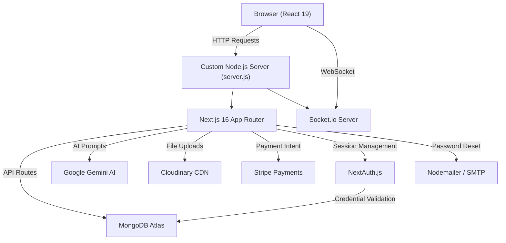
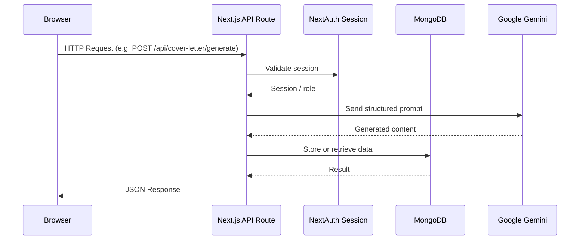

# CareerOstad — AI-Powered Job Matching & Career Guidance Platform

> A full-stack career platform where job seekers, companies, and admins interact through AI-driven tools, real-time messaging, a learning management system, and a complete job application pipeline.

<!-- Add a banner/screenshot here — please provide the image link and it will be added. -->
<!--  -->

---

## Overview

CareerOstad is a full-featured career platform built with Next.js 16 and React 19. It connects job seekers with companies through AI-powered matching, provides career development tools (quizzes, roadmaps, interview prep, cover letter generation), includes a built-in Learning Management System with certification, and supports real-time messaging between users. The platform supports three distinct user roles: **Candidate**, **Company**, and **Admin**, each with a dedicated dashboard.

---

## Features

### For Candidates
- AI-powered job matching based on resume and skills
- Career quiz and AI-generated career roadmap
- AI cover letter and resume generation
- Interview practice with AI-generated questions and answer evaluation
- Course enrollment, progress tracking, and PDF certificate generation
- Job applications with status tracking and saved jobs list
- Real-time messaging with companies
- Verification badge system

### For Companies
- Job posting and management
- AI-powered candidate matching from applicant pool
- Application review and status management
- Company profile with logo and branding
- Real-time candidate messaging

### For Admins
- Platform-wide statistics dashboard (users, jobs, applications)
- User management and role assignment
- Job category and featured job management
- Blog post and content moderation
- Learning course management
- Notification broadcasting
- Reporting and analytics with chart visualizations
- Platform settings configuration

### Platform-Wide
- Social and credential authentication (Google, GitHub, email/password)
- Forgot password via email (Nodemailer)
- Cloudinary-based avatar, resume, and media uploads
- Stripe payment integration for premium features
- Real-time notifications and chat via Socket.io
- Tawk.to live chat widget
- Route-level loading indicators and animated transitions
- Accessibility statement and ARIA-compliant UI
- Responsive design with Tailwind CSS v4 and DaisyUI

---

## Tech Stack

| Layer | Technology |
|---|---|
| **Framework** | Next.js 16 (App Router, custom server) |
| **UI Library** | React 19 |
| **Styling** | Tailwind CSS v4, DaisyUI v5 |
| **Animation** | Framer Motion, Lottie (DotLottie React) |
| **Database** | MongoDB (native driver + Mongoose ORM) |
| **Authentication** | NextAuth v4 (Credentials, Google OAuth, GitHub OAuth) |
| **AI Services** | Google Gemini (GenAI) — job matching, cover letter, interview, career quiz, roadmap |
| **File Storage** | Cloudinary (avatars, resumes, blog images, course content) |
| **Payments** | Stripe (React Stripe.js + Stripe Node SDK) |
| **Real-time** | Socket.io v4 (messaging, notifications) |
| **Email** | Nodemailer (password reset, verification) |
| **PDF Generation** | jsPDF + html2canvas (certificates) |
| **Charts** | Recharts |
| **Icons** | Lucide React, React Icons |
| **Alerts / Toasts** | SweetAlert2, React Hot Toast |

---

## Architecture

The application uses a **monolithic Next.js** architecture with a custom HTTP server layer that attaches Socket.io for real-time features.

### High-Level System Design



### Request Flow



### Key Structural Decisions

- **Dual DB access**: `src/lib/dbConnect.js` uses the native MongoDB driver for high-performance collection queries; `src/lib/mongoose.js` uses Mongoose for model-based operations (Courses, Certificates, Jobs).
- **Custom server**: `server.js` wraps Next.js in a plain Node.js HTTP server so Socket.io can share the same port without a separate WebSocket service.
- **Role-based access**: API routes check `session.user.role` (`candidate`, `company`, `admin`) before processing requests.
- **AI integration**: All AI features route through Google Gemini via `@google/genai`, with structured JSON parsing of model responses.

### Directory Structure

```
src/
├── app/
│   ├── api/              # All Next.js API route handlers
│   ├── dashboard/        # Role-based dashboards (admin, company, candidate)
│   ├── jobs/             # Job listing and detail pages
│   ├── learning/         # LMS course pages
│   ├── interview/        # Interview practice page
│   ├── login/ signup/    # Auth pages
│   └── ...               # (about, blogs, careers, profile, search, etc.)
├── components/           # Shared UI components
├── lib/
│   ├── authOptions.js    # NextAuth provider config
│   ├── dbConnect.js      # MongoDB native driver connection
│   ├── mongoose.js       # Mongoose ORM connection
│   ├── cloudinary.js     # Cloudinary upload helpers
│   └── socket.js         # Socket.io server initialization
├── models/               # Mongoose schemas (Job, Course, Certificate, etc.)
├── Providers/            # React context providers (NextAuth session)
└── middleware.js         # Route protection middleware
```

---

## Installation

### Prerequisites

- Node.js >= 18
- MongoDB Atlas cluster (or local MongoDB instance)
- Google Cloud project with Gemini API enabled
- Cloudinary account
- Stripe account
- Google and GitHub OAuth applications

### Steps

```bash
# 1. Clone the repository
git clone https://github.com/Foysal-Munsy/CareerOstad-AI-Job-Matching.git
cd career-ostad-main

# 2. Install dependencies
npm install

# 3. Create environment file and fill in required variables
cp .env.example .env.local

# 4. Run the development server
npm run dev
```

The app will be available at `http://localhost:3000`.

> **Note**: `npm run dev` runs `server.js` directly (not `next dev`) to enable Socket.io on the same port. Use `npm run dev:next` to run the standard Next.js dev server without real-time support.

---

## Environment Variables

Create a `.env.local` file in the root directory:

```env
# MongoDB
MONGODB_URI=mongodb+srv://<user>:<password>@<cluster>.mongodb.net/<dbname>

# NextAuth
NEXTAUTH_URL=http://localhost:3000
NEXTAUTH_SECRET=<generate with: openssl rand -base64 32>

# Google OAuth
GOOGLE_CLIENT_ID=<from Google Cloud Console>
GOOGLE_CLIENT_SECRET=<from Google Cloud Console>

# GitHub OAuth
GITHUB_ID=<from GitHub Developer Settings>
GITHUB_SECRET=<from GitHub Developer Settings>

# Google Gemini AI
GOOGLE_GENAI_API_KEY=<from Google AI Studio>

# Cloudinary
CLOUDINARY_CLOUD_NAME=<your cloud name>
CLOUDINARY_API_KEY=<your api key>
CLOUDINARY_API_SECRET=<your api secret>

# Stripe
STRIPE_PUBLIC_KEY=pk_test_...
STRIPE_SECRET_KEY=sk_test_...

# Nodemailer (SMTP)
EMAIL_USER=<your smtp email>
EMAIL_PASS=<your smtp password or app password>

# App
NODE_ENV=development
PORT=3000
```

---

## API Overview

All API routes live under `src/app/api/` and follow Next.js App Router conventions (exported `GET`, `POST`, `PUT`, `DELETE` handlers per route file).

### Authentication
| Method | Route | Description |
|---|---|---|
| `GET/POST` | `/api/auth/[...nextauth]` | NextAuth handler (login, OAuth callbacks, session) |
| `POST` | `/api/auth/forgot-password` | Send password reset email |

### Jobs
| Method | Route | Description |
|---|---|---|
| `GET/POST` | `/api/jobs` | List all jobs / create a job |
| `GET/PUT/DELETE` | `/api/jobs/[id]` | Get, update, or delete a specific job |
| `GET` | `/api/jobs/recommended` | AI-recommended jobs for the current user |
| `POST` | `/api/jobs/match` | AI job-to-profile match score |
| `POST` | `/api/jobs/detailed-match` | Detailed skill-by-skill match breakdown |

### Applications
| Method | Route | Description |
|---|---|---|
| `GET/POST` | `/api/applications` | List applications / submit an application |
| `GET/PUT` | `/api/company/applications` | Company view of received applications |

### AI Features
| Method | Route | Description |
|---|---|---|
| `POST` | `/api/cover-letter/generate` | Generate personalized AI cover letter |
| `POST` | `/api/resume/generate` | Generate AI-formatted resume |
| `POST` | `/api/interview/generate` | Generate AI interview questions |
| `POST` | `/api/interview/evaluate` | Evaluate submitted interview answers |
| `POST` | `/api/career-quiz` | Generate career assessment quiz |
| `POST` | `/api/career-roadmap` | Generate personalized career roadmap |
| `POST` | `/api/career-recommendations` | AI career path recommendations |
| `POST` | `/api/match-candidate` | Match candidates to a job posting |
| `POST` | `/api/match-skill` | Skill gap analysis for a role |

### Learning (LMS)
| Method | Route | Description |
|---|---|---|
| `GET/POST` | `/api/courses` | List / create courses |
| `GET/PUT/DELETE` | `/api/courses/[id]` | Course detail / update / delete |
| `POST` | `/api/courses/enroll` | Enroll current user in a course |
| `GET/POST` | `/api/courses/progress` | Get or update lesson completion |
| `GET/POST` | `/api/certificates` | List / issue certificates |

### Profile & Uploads
| Method | Route | Description |
|---|---|---|
| `GET/PUT` | `/api/profile` | Get / update candidate profile |
| `GET/PUT` | `/api/profile/company` | Get / update company profile |
| `POST` | `/api/profile/upload-avatar` | Upload avatar to Cloudinary |
| `POST` | `/api/profile/upload-resume` | Upload resume PDF to Cloudinary |

### Admin
| Method | Route | Description |
|---|---|---|
| `GET` | `/api/admin/stats` | Platform-wide statistics |
| `GET/PUT` | `/api/admin/users` | List users / update roles |
| `GET/POST/DELETE` | `/api/admin/blogs` | Blog content management |
| `GET/POST/PUT/DELETE` | `/api/admin/categories` | Job category management |
| `GET/POST` | `/api/admin/feature-jobs` | Featured jobs management |
| `GET` | `/api/admin/reports` | Analytics reports |
| `GET/POST` | `/api/admin/notifications` | Broadcast notifications |
| `GET/PUT` | `/api/admin/settings` | Platform settings |

### Payments & Misc
| Method | Route | Description |
|---|---|---|
| `POST` | `/api/create-payment-intent` | Create Stripe payment intent |
| `GET/POST` | `/api/messages` | Real-time message history |
| `GET/POST` | `/api/notifications` | User notifications |
| `GET` | `/api/search` | Global search (jobs, users, courses) |
| `POST` | `/api/verification` | Submit verification request |

---

## Future Improvements

- **TypeScript migration**: Convert from JavaScript to TypeScript for stronger type safety across API routes and models.
- **Job alerts**: Email/push notifications when new jobs match a candidate's saved profile criteria.
- **Video interviews**: WebRTC-based async video recording flow for interview submissions.
- **Resume parser**: Auto-extract skills and experience from uploaded PDF resumes on registration.
- **Multi-language support**: Add i18n for broader regional reach.
- **Rate limiting**: Per-endpoint rate limiting on AI and auth routes to prevent abuse and control costs.
- **Test suite**: Unit and integration tests for API routes and AI prompt logic.
- **Redis caching**: Cache frequently-read data (jobs, categories) to reduce MongoDB query load at scale.

---

## Color Palette

CareerOstad uses a consistent color palette designed for trust, clarity, and a modern AI-driven feel.

| Color | HEX | Usage |
|---|---|---|
| Primary Blue | `#2563eb` | Branding, headers, primary CTAs |
| Accent Green | `#10b981` | Success states, positive highlights |
| Warning Amber | `#f59e0b` | Alerts, warnings |
| Primary Text | `#1e293b` | Body text, major UI content |
| Secondary Text | `#64748b` | Metadata, helper text |
| Background | `#f8fafc` | Page background |
| Border | `#e2e8f0` | Dividers, UI borders |
